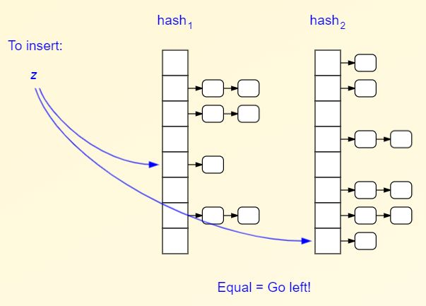

## 2-left hashing
- **What?** 2 equal sized hash tables having 2 seperate hash functions are used. Seperate chanining is used in both.
```c
  -> Table1, Table2
  -> Hash1, Hash2
```


- **Inserting key into table**
  - Always keep Table1 loaded, key is inserted into Table2 only when too many collisions happen on Table1.
- **Advantages?**
  - _1._ On parallel systems. 2 cores can query 2 hash tables, ie Thread-1 can query Table1 and Thread2 Table2.
