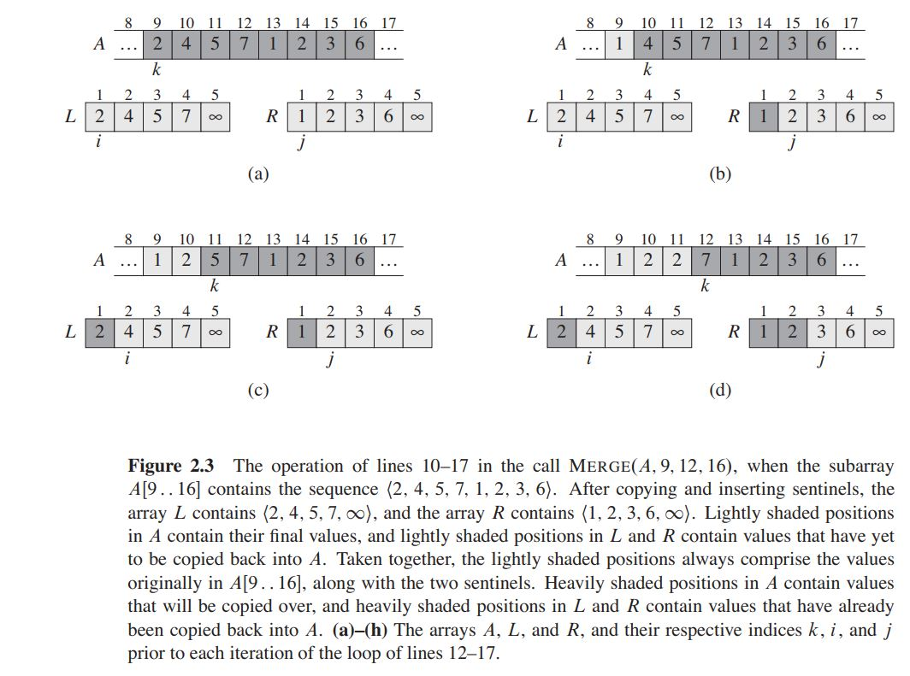

**:heartbeat: In computer science, the mental representation for a problem is often closely related to its solution.:heartbeat:**

### Merge Sort

### [Self Video](https://youtu.be/Yb7n-eImWL0)

#### Phases
- *1. Divide* Divide problem into subproblems.
- *2. Conquer:* Solve each subproblem recursively.
- *3. Combine:* Solutions to the subproblems into the solution for the original problem.

#### Logic
  - *1.* Keep dividing input array into 2 halves recursively(as in binary search), until reach array of size=2
  - *2.* Pass array `{10,5} left=0,mid=0,right=0` to MergeSubArrays() function.
    - *2a.* Create a local copy, leftArr = {10}
    - *2b.* Create a local copy, rightArr = {5}
    - *2c.* Traverse leftArr, rightArr. Whichever has smaller element merge to original array
    - *2d.* If any subarray(leftArr or rightArr) is exhausted, Merge remainining elements to original array
```c
      10  5  4  2  7  6   << v
      0   1  2  3  4  5   << index
      
      fun(v, left=0, right=5) {
        if (left>=right)
          return;
          
        mid = (left+right)/2;   //2
        fun(v, left=0, mid=2);
        fun(v, mid+1=3, right=5);
        combine(v, left, mid, right);
      }

  fun(v, 0, 2) {
    mid = 1
    fun(v,0,1)
    fun(v,1,2)
    combine()
  }

fun(v,0,1) {
  mid = 0
  fun(v,0,0)
  fun(v,1,1)
  combine(v,0,1,1)
}

combine(&v,left,mid,right)
  //original array becomes 5 10 4 2 7 6
```



#### Code  //Top Down Approach
```c++
#include<iostream>
#include<vector>
using vec1d = std::vector<int>;

void combine(vec1d& v, int left, int mid, int right) {

  //Create 2 sub arrays: left, right
  int leftArrSize=mid-left+1;
  int rightArrSize=right-mid;
  int leftArr[leftArrSize], rightArr[rightArrSize];

  //Fill 2 subarrays from Original array
  for(int i=0;i<leftArrSize;++i)                        //2a
    leftArr[i] = v[left+i];
  for(int i=0;i<rightArrSize;++i)                       //2b
    rightArr[i] = v[mid+1+i];

  int i,j,k;
  i=0, j=0, k=left;

  //Change elements of Original array
  while(i<leftArrSize and j<rightArrSize){              //2c
    if(leftArr[i] <= rightArr[j]){
      v[k] = leftArr[i];
      ++i;
    }else{
      v[k] = rightArr[j];
      ++j;
    }
    ++k;
  }

  //Merge Extra elements in left Subarray               //2d
  while (i<leftArrSize) {
    v[k] = leftArr[i];
    ++k; ++i;
  }

  //Merge Extra elements in right Subarray              //2d
  while (j<rightArrSize) {
    v[k] = rightArr[j];
    ++k; ++j;
  }
}

void MergeSort(vec1d& v, int left, int right){            //1
  if (left>=right)
    return;

  int mid = (left+right)/2;
  MergeSort(v, left, mid);
  MergeSort(v, mid+1, right);
  combine(v, left, mid, right);
}

int main(){
  vec1d v = {10,5,4,2,7,6};
  MergeSort(v, 0, v.size()-1);
  for (const auto i:v)
    std::cout<<i<< " ";
}
```
#### Complexity
  - **Time: O(nlogn)**
    - n: To divide the array, complete array needed to be traversed
    - logn: Array is divided in binary tree format.
  - **Space: O(n)** A auxillary subarrays are created and merged back to original array.
