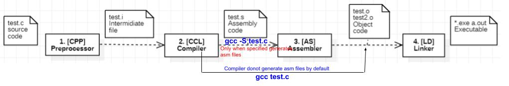

**Compilation Steps**
- [1. Preprocessor](#pre)
- [2. Compiler](#comp)
- [3. Assembler](#asm)
- [4. Linker](#link)
  - [4.1 Steps for building executable](#steps)
  - [4.2 Linker Errors](#lerr)
    - [a. linker input file unused because linking not done](#lerr1)
    - [b. Undefined Reference](#lerr2)
      - [b1. No Definition Provided For Object](#reason1)
      - [b2. Wrong/Mismatched Definition](#reason2)
      - [b3. Object files not linked properly](#reason3)



```c
//cat test.c
#include<stdio.h>
int main(){
  printf("Hello");
}
```
<a name=pre></a>
## 1. `CPP` Pre-processor `(*.c → *.i)`
  - Converts source-code `*.c` to Intermidiate files `*.i`.
  - **Functions:** Remove comments from code. Expands include statements, macros. Expands anything else with `#`
  - **-E Flag** Stop after the preprocessing stage; do not run the compiler proper.
```c  
  # gcc -E test.c > m
  # cat m
typedef unsigned char __u_char;
...
extern int fprintf (FILE *__restrict __stream,
      const char *__restrict __format, ...);
extern int printf (const char *__restrict __format, ...);
...
int main(){
 printf("Hello");
}
```    
<a name=comp></a>
## 2. [`CCL` Compiler `(*.i → *.o)`](compiler.md)
  - Generates Object files. Only when told compiler generates asm files. Converts Intermediate files to object files.
  - Compiler is only bothered about ***function declaration***, it does not check definition.
  - Linking definition to function is task of ***Linker***. Linker gives `undefined reference` error if it cannot find definition inside `*.obj` OR  `*.so`  OR  `*.a`
  - **Functions** Lexical Analysis, parsing, Semantic Analysis, Verify code syntax
  - **-S Flag** Stop after the stage of compilation proper; do not assemble
```c
  # gcc -S test.c
  
  # cat test.s
  .file "test.c"
  .text
  .section  .rodata
.LC0:
  .string "Hello"
  .text
  .globl  main
  .type main, @function  
```      
<a name=asm></a>
## 3. `[AS]` Assembler `(*.s → *.o)`
  - Takes `*.s` as input and outputs [Object files](Object_File) `*.o`.
  - **-c Flag** Stop after assembly stage not to run into linker.
```c
  # gcc -c test.c
  # cat test.o
 ^?ELF^B^A^A^@^@^@^@^@^@^@^@^@^A^@>^@^A^@^@^@^@^@^@^@^@^@^@^@^@^@^@^@^@^@^@^@^P^C^@^@^@^@^@^@^@^@^@^@@^@^@^@^@^@@^@^N^@^M^@ó^O^^
 úUH<89>åH<8d>=^@^@^@^@¸^@^@^@^@è^@^@^@^@¸^@^@^@^@]ÃHello^@^@GCC: (Ubuntu 9.3.0-10ubuntu2) ....
```

<a name=link></a>
## 4. `[LD]` Linker `(*.o → *[.exe])`
- lets you are working on project having 10 modules, each having seperate `*.c` file. All c files create object files and at end you want 1 EXE file. Linker does it. Linker links code from library
<a name=steps></a>
### 4.1 Steps for building executable
- ***Symbol resolution*** Obj files define and reference symbols. The purpose of symbol resolution is to associate each symbol reference with exactly one symbol definition.
- ***Relocation*** Compilers and assemblers generate code and data sections that start at addr 0. The linker relocates these sections by associating a mem location with each symbol definition, and then modifying all of the references to those symbols so that they point to this mem location.
```c
# ld -o hello-world [sys obj files and args] /tmp/test1.o /tmp/test2.o
```

<a name=lerr></a>
### 4.2 Linker Errors
- These errors which occurs at linking stage. This means Compiler compiles the program successfully, which linker(Finding actual definition in CS) finds error.

<a name=lerr1></a>
#### a. linker input file unused because linking not done
```c
$ g++ -Wall -c -I. -I(include-path) -O2 -std=c++11 -fpic -o test.o archive.a main.o
g++: warning: archive.a: linker input file unused because linking not done

Solution: g++ -c means `compile the source file`. If you meant to link it, remove -c from the command line.
```
<a name=lerr2></a>
#### b. Undefined Reference
- *Compiler* can find reference of object (class, function, variable, etc.).    //Compilation Ok
- *Linker* cannot find the definition of a linked object.
<a name=reason1></a>
- **b1. No Definition Provided For Object:** The programmer has forgotten to define the object.
```cpp
int fun();
int main() {
    fun();
}
$ g++ test.cpp
/usr/bin/ld: /tmp/ccJoOloD.o: in function `main':
undefined-reference.cpp:(.text+0x9): undefined reference to `ffun()'
collect2: error: ld returned 1 exit status

Solution: Provide definition of fun()
```

<a name=reason2></a>
- **b2. Wrong/Mismatched Definition:** Definition of function is different from what's declared.
  - In Example below, declaration of function does not contain parameter, while definition does.
```cpp
int fun();
int main() {
    fun();
}
int fun(int n){
    cout<<"hello, world!!";
}
/usr/bin/ld: /tmp/cc3VJO9c.o: in function `main':
undefined-reference1.cpp:(.text+0x9): undefined reference to `fun()'
collect2: error: ld returned 1 exit status
```

<a name=reason3></a>
- **b3. Object files not linked properly:** We have more than 1 source file and those are compiled independently. While linking, object files are not linked properly.
- Example: function `fun()` is declared in main.cpp & defined in `test.cpp`. 
  - When main.c is compiled seperately. We get -> undefined Reference
  - When both files are compiled together. No Error.
```cpp
/////////////test.cpp////////////////
void fun(int a){
  cout<<a;
}

////////////main.cpp////////////////
int fun(int);
int main(){
  cout<<fun(1);
}
$ g++ main.c                                      <<<<<<<<<<<<<<<<Error when main.cpp is compiled seperately ie definition is not found
/usr/bin/ld: /tmp/ccugsclC.o: in function `main':
main.c:(.text+0xe): undefined reference to `fun(int)'
collect2: error: ld returned 1 exit status

$ g++ test.c main.c                               <<<<<<<<<<<<< No Error
$
```
