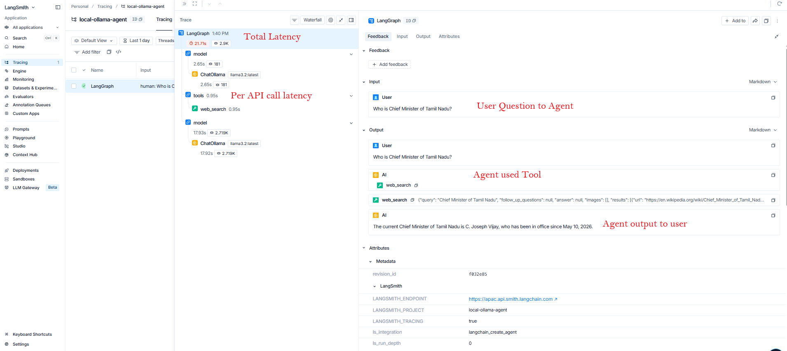

:toc:
:toclevels: 3

== Code
- Create API Key on langsmith
- Note LANGSMITH_ENDPOINT
- Include following in env: LANGSMITH_TRACING, LANGSMITH_API_KEY, LANGSMITH_ENDPOINT, LANGSMITH_PROJECT
- Once above variables are provided code will automatically send logs to langsmith.

```py
from langchain_ollama import ChatOllama
from pprint import pprint
from langchain_core.messages import SystemMessage, HumanMessage
from langchain.tools import tool
from langchain.agents import create_agent
from tavily import TavilyClient
from typing import Dict, Any
import os
import json

os.environ["TAVILY_API_KEY"] = "XXX"              # For Web search tool

os.environ["LANGSMITH_TRACING"] = "true"
os.environ["LANGSMITH_API_KEY"] = "YYY"
os.environ["LANGSMITH_ENDPOINT"] = "https://langsmith-endpoint"
os.environ["LANGSMITH_PROJECT"] = "local-ollama-agent"

#(toolname, "tool description for agent understanding")
@tool("web_search", description="Search the web for information")
def tool1(query:str) -> Dict[str, Any]:
    # Instantiating TavilyClient without arguments automatically reads TAVILY_API_KEY from environment
    tavily = TavilyClient()
    return tavily.search(query=query)

# Initialize the Ollama LLM
llm = ChatOllama(
    model="llama3.2:latest",
    base_url="http://localhost:11434",
    temperature=0
)

# Create the agent
agent = create_agent(
    model=llm,
    tools=[tool1],
    system_prompt="You are an intelligent knowlegable agent"
)

question = HumanMessage(content="Who is Chief Minister of Tamil Nadu?")

response = agent.invoke(
    {"messages": [question]}
)
print(response)
```

== Benefits of Langsmith (wrt print)
- Structured display of every parameter, which call took how much time. What calls were made etc.


