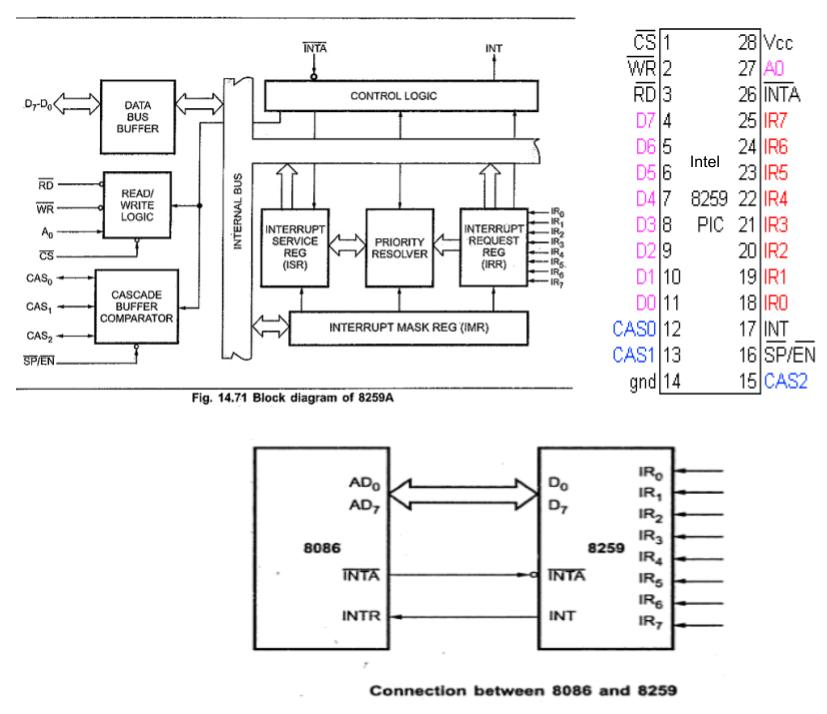

## PIC / Programmable Interrupt Controller / 8952 Intel
- **Pins**
  - D0-D7	Bi-directional, tristated, buffered data lines. Connected to data bus directly or through buffers
  - RD-bar	Active low read control
  - WR-bar	Active low write control
  - A0	Address input line, used to select control register
  - CS-bar	Active low chip select
  - CAS0-2	Bi-directional, 3 bit cascade lines. In master mode, PIC places slave ID no. on these lines. In slave mode, the PIC reads slave ID no. from master on these lines. It may be regarded as slave-select.
  - SP-bar / EN-bar	Slave program / enable. In non-buffered mode, it is SP-bar input, used to distinguish master/slave PIC. In buffered mode, it is output line used to enable buffers
  - **INT	Interrupt line, connected to INTR of microprocessor**
  - INTA-bar	Interrupt ack, received active low from microprocessor
  - IR0-7	Asynchronous IRQ input lines, generated by peripherals.

