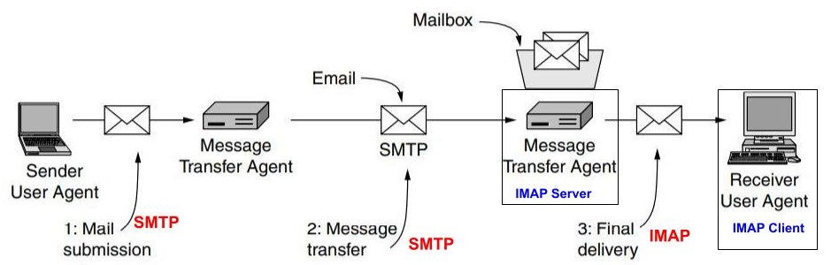

## SMTP (Simple Mail Transfer Protocol) / Port:25 / RFC 5321
- Protocol for sending mails and reporting delivery status/errors. Final Message delivery is done using [IMAP](/Networking/OSI-Layers/Layer5/Protocols/Email/IMAP_Internet_Message_Access_Protocol) or [POP3](/Networking/OSI-Layers/Layer5/Protocols/Email/POP3_Post_Office_Protocol_v3).
- **Entities/Nodes in SMTP**
  - **1. User Agent/Email Reader(Outlook/Gmail/Thunderbird etc):** Allows people to read/send/compose/search mail.
  - **2. Message Transfer Agent:** Transfers messages from source to destination. Runs on  mail server machines. Uses SMTP to send mail from sender to reciever.

- [SMTP Terms](Terms.md)
- [SMTP Server client Exchange, Packet Flow](Packet_Flow.md)
- **Disadv:** No authentication, SMTP sends ASCII data, sends message as clear text(no Encryption).
  - Solution: ESMTP(Extended SMTP)
