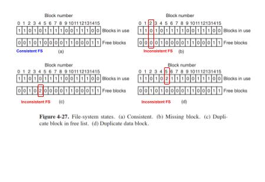

## Block Consistency Check
- **Block?** A file will have multiple blocks.

### How fsck works?
#### A. Check blocks in Files
- **1. Building occupied,free block tables**
  - fsck will read all [file inodes](../I_Node_IndexNode.md) and builds 2 tables. Initially both tables are memset(0).
    - Table-1: How many times each block is present in a file
    - Table-2: how often each block is present in the free list

- **2. Findings from Tables**
  - *table-a.* CONSISTENT_FILESYSTEM. if filesystem is consistent each block will have a 1 either in the first table or in the second table.
  - *table-b.* INCOSISTENT_FILESYSTEM. After crash there would be a block that does not occur in either table. This is a missing block.
    - Solution: file system checker adds them to the free list.
  - *table-c.* INCOSISTENT_FILESYSTEM. Block number 4, that occurs twice in the free list.
    - Solution: rebuild the free list.
  - *table-d.* INCOSISTENT_FILESYSTEM. Block 5, same data block is present in two or more files.
    - Solution:  allocate a free block, copy the contents of block 5 into it, and insert the copy into one of the files

#### B. Check Directory system
- Here also it uses tables of counters, but these are per file(not per blocks).
