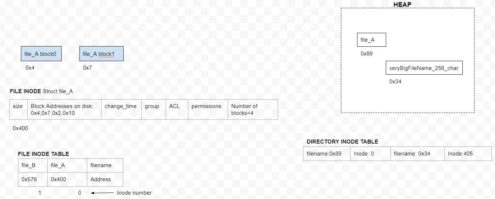

- **File System**
  - [1. Windows FS](#wfs)
  - [2. Linux FS](#lfs)
  - [3. Virtual File System](#vfs)
  - [4. HDFS(Hadoop Distributed Filesystem)]
- **Inode**
  - [1. File Inode](#fi)
  - [2. Directory Inode](#di)
- [File Descriptor Table](#fdt)


## Filesystem
Format of storing data on Hard disk or usb. Every resource in Linux is treated as File, we can read/write on them. Eg: IBM's OS: HPFS(High Performance File System)

<a name=wfs></a>
### 1. Windows File system  
```c
Examples:
              FS             |    Used By
-----------------------------|-------------
FAT16(File allocation table) |  MsDOS
exFAT(Extended FAT)          | Windows Vista, XP
NTFS                         | Windows NT
```
#### Architecture
```c
    | PBS |  File Table | Root Dir | Clusters |
    
  PBS(Parititon Boot Sector)/MBR: Location of BIOS, other OS details(sector size, ptr to file table)
  File Table: ptrs to clusters. OS uses clusters to store files.    
  Root Dir: Metadata of files stores in each directory.    
  Clusters: Actual data storage    
```

<a name=lfs></a>
### 2. Linux FS
Examples: Ext2(extended file system),ext3,ext4, xfs, gfs(Gluster)
#### Architecture


 - **MBR(Master boot record):** Present at sector=0 of disk. MBR locates Active partition and reads parition's 1st block(called boot block). Boot block contains boot loader. Every partition's 1st block is Boot block(even it contains bootable OS or not).
- **PARTITION TABLE:** Lies at end of MBR. Contains start, end address of each partitions. 1 of partitions is marked ACTIVE.
- **STORING DATA?** Disk stores MBR(Master Boot Record contains bootloader), PARTITION TABLE() and Actual Partitions itself.
- **Partition(Only 1 is marked Active):** Each partition has separate OS installed. 
  - Boot Block: Contains program to load OS(**ie Bootloader**) present on this partition.
  - Superblock: Contains all key parameters about file system
  - Free Blocks: Array of pointers pointing to free blocks
  - [I-Nodes(info about files)](#fi): array of structure (1 per file) containing all info of file
  - Root-Dir: This is top of file system tree
  - Files & Directories: Reminder of disk contains other files and directories.

<a name=vfs></a>
### 3. Virtual File System/VFS
Integrating multiple/incompatible file systems into a single structure. But User will see only 1 file-system hierarchy.
- **Example**
  - Linux system could have ext2 as the root file system  //from hard-disk-1
  - ext3 partition mounted on /usr    //From HD-1
  - Reiser file system mounted on /home //From HD-2
  - xfs mounted on /test    //Using NFS
```c
                      /(root) [ext2]//HD1
                         |
  -------------------------------------------------------------------------------------
  |                         |                              |                          |(remote NFS)
 /usr[ext3]//HD1          /home[ReiserFS]//HD2          /mnt[ISO 9660 CD-ROM]       /test
```

#### Architecture
- All system calls(from user space eg: open(),read(),write()) relating to files are directed to the virtual file system for initial processing.
- **VFS Interface?** VFS can make API calls to each file system to get work done. Also every file system should provide APIs to VFS


#### Example Flow
- **1. Registration** Root or other filesystem(permanent fs) gets regitered with VFS. As any file system is mounted it gets registered with VFS.
  - *Information provided at registration to VFS by file-system*
    - *a.* list of callbacks which VFS should call to communicate with file system.
- *2.* User opens are file from `/usr` which is mounted using `/ext3`, call reaches VFS
- *3.* VFS searches [Superblock](/Operating_Systems/Linux/FileSystem/What_is_FileSystem.md) of mounted filesystems and finds root dir of mounted file system and finds `include/unistd.h` there.
```c
                    VFS               File-System-1(ext2)
                     | <--Register-------|                         //1
                     |                                 File-System-2(ext3)
                     |<---------Register-----------------|
     User
open("/usr/include/unistd.h", O RDONLY)   //2
  |
  |-system call--> VFS
                Search superblock of mounted filesystems      //3
                Find root dir of mounted File system
                Find include/unistd.h there
```

## Inode / I Node
Data structure maintained by kernel containing file, directory information.
<a name=fi></a>
#### 1. File Inode
- Each file have separate inode structure containing following information of that file: size, change time, group, Permissions, number of blocks, each block address. 
- Every time user writes to file, new block is stored at new disk location and addresses is added.
- **What information is not in Inode?** File name(stored on heap), file content(stored on disk blocks).
```c
     struct inode File_A{
        attributes{size, change time, group, permissions, number of blocks};
        uint64_t Block_Addresses[] = {4, 7, 2, 10};            //Addresses of blocks of file_A on Disk
    };
```
**Advantage:** Whole FAT table need not to be bought into RAM. Only inode structures of files which are opened need to be bought in RAM. if k files are opened of size=n, then kn RAM is occupied.



<a name=di></a>
#### 2. Directory Inode
- File entry inside Directory contains filename(allocated on heap) and file's inode no. 
- **Why Filename is allocated on Heap?**
  - If we allocate bigger filename on disk ie in directory and later file is deleted it will leave a hole same problem as in contigious disk allocation(See Above).

<a name=fdt></a>
## File Descriptor Table
- Every opened file has a entry inside FDT.
- Mapping of opened file descriptors to [File inode](/Operating_Systems/Linux/FileSystem/I_Node_IndexNode.md).
- When user opens a file(using system call open()) a file descriptor is provided, Entry is created in file Descriptor table which points to inode of opened file.
```c
int fd = open("/home/test", O_RDONLY | O_CREAT);  //fd=3


File descriptor table
..| inode=50(/home/test) |stderr | stdout  | stdin  |
        3                   2         1         0       <-File descriptors

50 points to inode of file=/home/test
```
