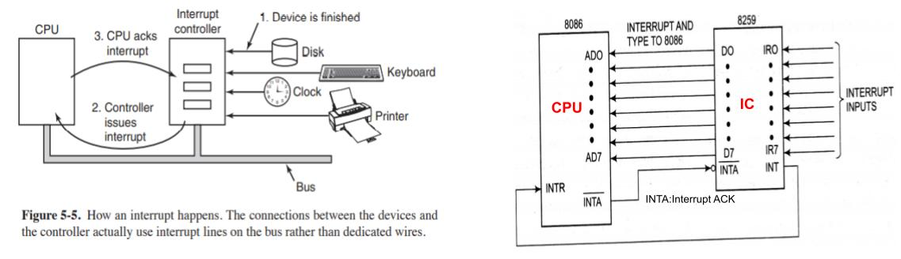

## Hardware Interrupt reaching CPU
  - User is watching a movie and presses key on keyboard(hardware device). Hardware device/Periheral generates H/W Interrupt sends to [Interrupt Controller-8952 on IR0-IR7 lines](/Motherboard/8952_PIC). IC decides priority of Interrupt and forwards to CPU on [CPU's INTR(Interrupt) PIN](/Motherboard/CPU/8086/PIN_Diagram.md).
  - CPU stops what it is doing and [Saves state](Things_CPU_does_after_getting_Interrupt.md).
  - Finds [ISR(Interrupt Service Routine/Interrupt Handler)](ISR_Interrupt_Service_Routine.md) from [IVT(Interrupt Vector Table)](IVT_Interrupt_Vector_Table.md), executes ISR. After completing the ISR resumes the task what it was doing.

