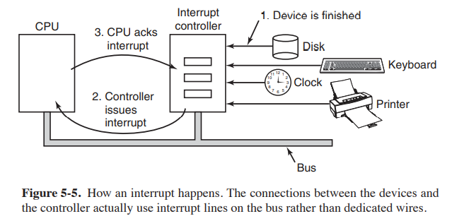

## Interrupt?
- **What?** This is signal sent by IO device(Eg: keyboard) to Interrupt Controller(IC) when I/O device want CPU to do some task. 
  - Ex: User is watching a movie(CPU using Video Memory) and presses key on keyboard(hardware device) to pause it, Interrupt is generated & sent to CPU on Interrupt line.
    - *Interrupt Lines(IL):* Every device is connected to IC on IL, these are 15-16 in total. These are shared between devices. IL should not be reserved by 1 device.
- **How?** 
  - IC forwards Interrupt to CPU, CPU stops what it is doing and [Saves state](Things_CPU_does_after_getting_Interrupt.md).
  - Finds [ISR(Interrupt Service Routine/Interrupt Handler)](ISR_Interrupt_Service_Routine.md) from [IVT(Interrupt Vector Table)](IVT_Interrupt_Vector_Table.md), executes ISR. After completing the ISR resumes the task what it was doing.
    - **INTERRUPT CONTROLLER?** Chip present on motherboard, which detects and forwards interrupt to CPU on address bus. Older computers might not have this, there devices need to talk with CPU directly.

- **Interrupt Numbers?** 256 types of Interrupts(0-255). Examples: 0: Pointer Divide Error    1: Pointer single Step    2: Pointer Non-maskable    3: Pointer I-Byte NIT Instruction    4: Pointer Overflow    5-31: Reserved for future use
- All reported Interrupts are shown in [/proc/interrupts and /proc/stat](Interrupts_Information.md).
