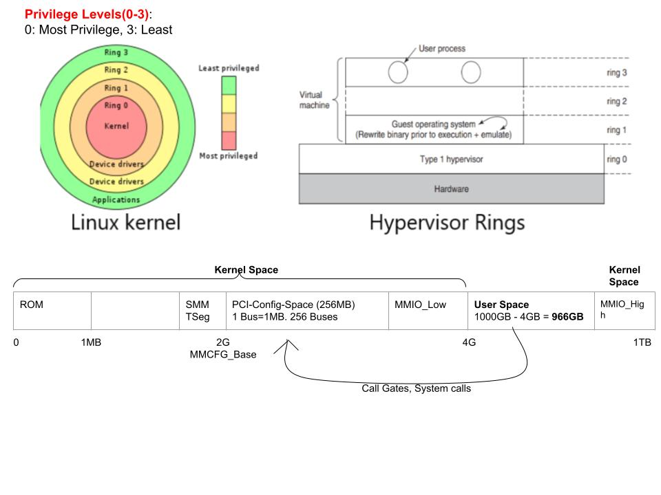

## Protection Rings / Protection Domains
- **What?** Different levels(2 or more) are provided to access the resources.
  - Linux: 4 rings
  - Windows: Windows(7, Server 2008) uses 2 rings
- **Examples:**
  - *1.* zoom(User program in Ring 3) wants to turn on camera should take permission from Ring 1(device drivers)
  - *2.* Web browsers(Ring 3) should take permission from Ring 1(Network device drivers).

