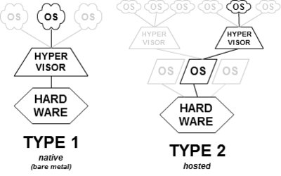

## VMM(Virtual Machine Monitor)/Hypervisor
- Creates the illusion of multiple (virtual) machines on the same physical hardware. Types of VMMs:
  - *1. TYPE-1/NATIVE/BARE-METAL/ESXI:* Run directly on the host’s hardware. Eg: Citrix Xenserver, microsoft Hyper-V, VMWare ESX/ESXi.mid
  - *2. TYPE-2/HOSTED:* Run as a software layer on an operating system, like other computer programs. Eg: VMWare Work Station, VM-Ware Player, Virtual box, QEMU

