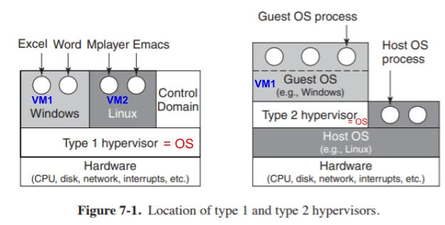

## VMM(Virtual Machine Monitor)/Hypervisor
- **What?** Creates the illusion of multiple (virtual) machines on the same physical hardware. 
- **Types of VMMs?**
  - **1. TYPE-1/NATIVE/BARE-METAL/ESXI:** Run directly on the host’s hardware. Eg: Citrix Xenserver, microsoft Hyper-V, VMWare ESX/ESXi
  - **2. TYPE-2/Hosted Hypervisor:** Run as a software layer on an operating system, like other computer programs. Eg: VMWare Work Station, VM-Ware Player, Virtual box, QEMU

- **Traps to kernel?** Each VM directs the system calls to kernel using VMM. VMM traps into kernel.
