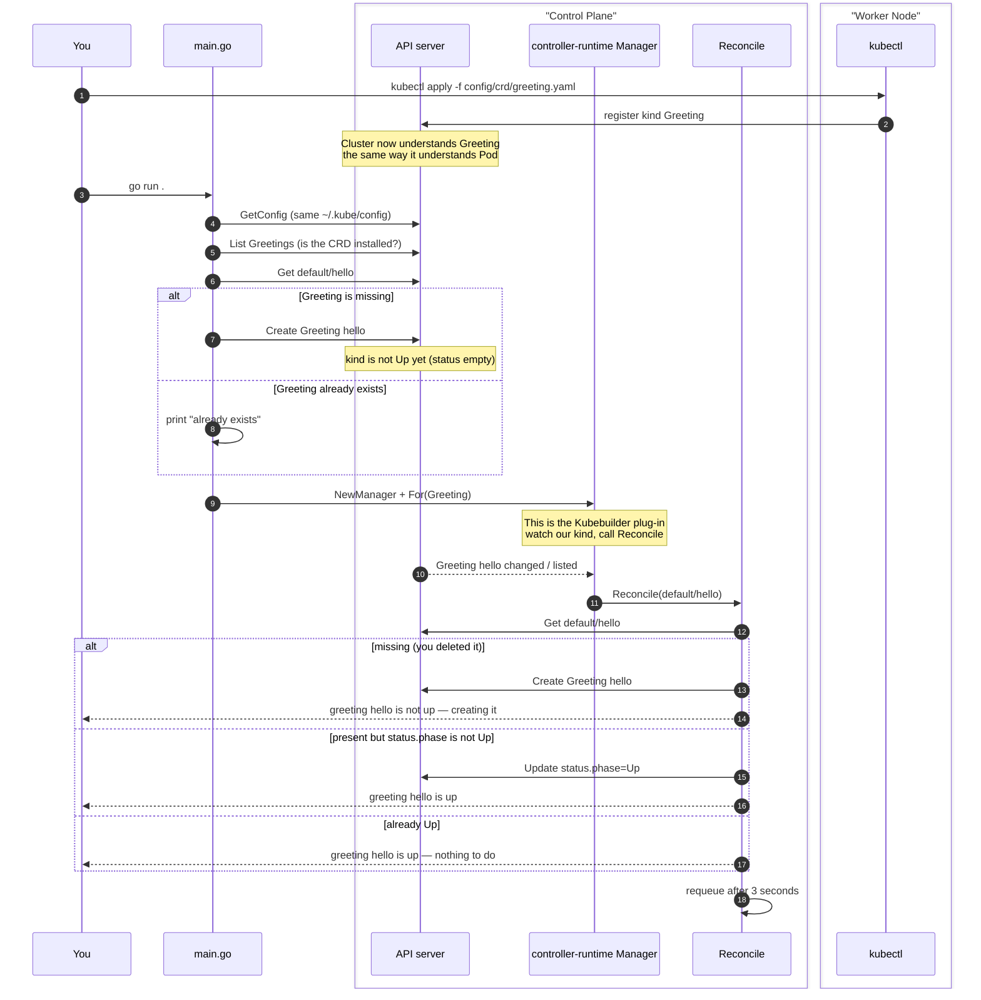

This Code is reference [here](https://code-with-amitk.github.io/System_Design/Concepts/Kubernets/Terms.html#Kubebuilder): Donot Delete

# [Kubebuilder?](https://code-with-amitk.github.io/System_Design/Concepts/Kubernets/Terms.html#Kubebuilder)

## How Kubebuilder plugs into a Kubernetes controller

Kubebuilder is not a second control plane. It sits on top of the same stack (ie api server):
```
You                    Kubebuilder / this repo              Kubernetes
─────────────────      ────────────────────────────────     ──────────────────
go run .          -->  controller-runtime Manager      -->  same kubeconfig
                       (this is the plug-in)                as kubectl
                              |                             API server
                              v
                       Reconcile()                          Greeting CR
                       Get / Create / Update status         (not a Pod)
```

1. **`config/crd/greeting.yaml`** — teaches the [API server](https://code-with-amitk.github.io/System_Design/Concepts/Kubernets/Architecture.html) a new kind named `Greeting`.
2. **`greeting.go`** — the Go type for that kind (`spec.message`, `status.phase`, `status.said`) and the scheme registration that plugs it into the Manager.
3. **`main.go`** — connect to the cluster, start the Manager, ensure `default/hello` exists, then check whether it is Up.

## Sequence: install the kind, then keep it up


## Compile, Run, Start
```bash
go build -o hello-world .

kubectl apply -f config/crd/greeting.yaml
kubectl get crd greetings.demo.example.com

go run .
```

Leave that terminal running. In another terminal:
```bash
kubectl get greetings
kubectl get greeting hello -o yaml
```
Delete it. The controller creates it again, same as deleting the pod in the other project:
```bash
kubectl delete greeting hello
kubectl get greeting hello -w
```

### Cleanup

```bash
# stop the controller with Ctrl+C, then:
kubectl delete greeting hello --ignore-not-found
kubectl delete -f config/crd/greeting.yaml
```
