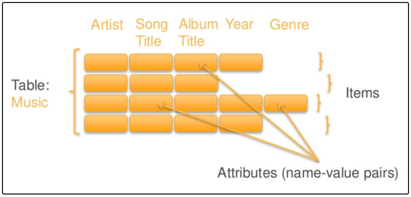

**Dynamo DB**

## Dynamo DB
- This is [serverless](/System-Design/Concepts/AWS/). Provides single-digit millisecond retrieval at any scale, stored on **SSD.**
- Supports both: document data model, key value data model
- Read consistent by default. Consistency across all copies of data is usually reached within a second
- 

