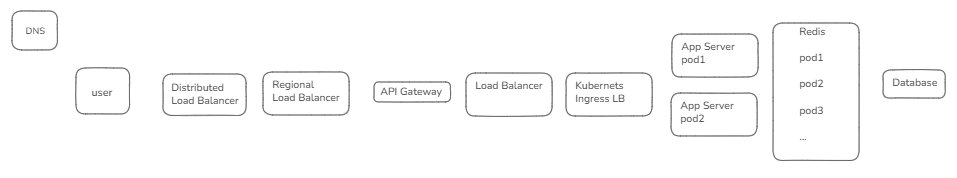
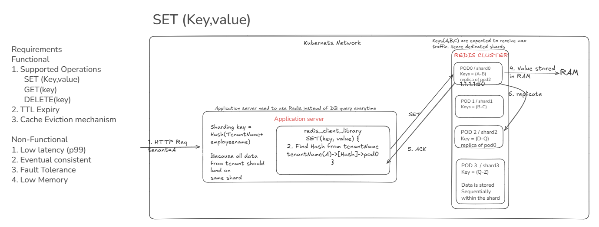
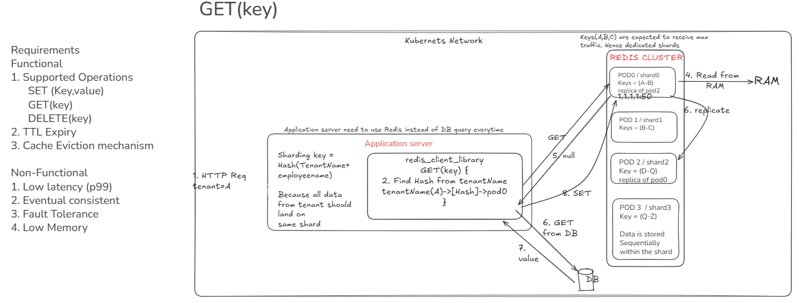

:toc:
:toclevels: 6

== Cache?
- Cache is Frequently-read value stored near to App server instead of DB
- Eg: key(session_token) → data(user/session data) stored in Redis.
```
key        Value
abc123    user_id: A123, role: admin, expires: 10:30
```
- Every HTTP connection requires session information(Valid beraer token etc), Million req/sec going everytime to DB would make Disk read and that's slow wrt RAM.
- Indexing on SQL makes search operation in O(logn) not less than that.

== Distributed Cache
> link:/System-Design/Concepts/Cache/DB_Caches/Redis/README.md[Redis, Memcached]

**Meaning of Distributed Cache**

- Distributed does not mean Region1(redis) will sync data to Region2(redis).
- Redis is a cache—not the source of truth—so regions do not synchronize cached data with one another; they rebuild cache entries from the database or other authoritative backend when needed.
- "Distributed" means how cache data is partitioned across multiple Redis nodes (shards) within a 1 region ONLY.
- Each region maintains its own independent Redis cluster(Cache), which caches data for requests served in that region.

= Requirements
**Functional**

- 1. Support basic operations
```
SET(key, value)
GET(key)
DELETE(key)
```
- 2. Have TTL/expiration
- 3. Cache Eviction mechanism. What happens when memory is full, whether the system supports cache refresh/invalidation.

**Non Functional**

1. Low latency. (p99: 99% of requests finish in that amount of time or less)
2. Eventual consistency
3. Fault Tolerance
4. Memory efficient

= link:/System-Design/Scalable/twitter/README.md[BOE]
- Assuming Cache is deployed at twiteer. BOE same as twitter
- **Traffic Estimates**: same as twitter
- **Storage Estimates:**
  - 1 Machine can store 10TB to 50TB.
  - Number of machines required to build Distributed cache = (Total storage for 1 day = 300TB)/10TB = 300-400. 
- **Latency** 1ms (GET or POST)
  
= HLD



== 1. Writing to Redis SET(Key, value)
- HTTP request arrives at the application server. AppServer calls SET(key, value).
- Redis client library calculates the hash(key) to find redis pod/shard/partition to which data should be sent and send SET request to Redis pod/shard/partition.
- Kubernetes provide IP:port for redis pod, pod writes to RAM sends ACK back to app server



**Sharding Key**

- We take {tenant name}+{customer name} as key, since all traffic from same tenant will be stored on same shard, which will help to query faster.
- Suppose shard-0 is dedicated to tenant name=A. But what if tenantName=A starts generating 50x traffic, then this shard will become hotspot
** Solution: HPA more shards

=== Non Func Requirements
==== Fault Tolerance & Idempotency
**Crash**:

- **Redis pod crash:** Redis Replica bring up. keys gets distributed among existing pods. To save cost of rehashing we use link:/System-Design/Concepts/Hashing/README.md[Consisten Hashing]
- **Application pod crash:** 
** Application server calls SET(key, value) from client library. redis client library sends requests to pod0. Pod0 writing to RAM, inbetween App server crashed>redis client library died. Connection between redis client lib and pod0 closed.
** pod0 wrote to RAM, now want to send ACK to redis_client_lib, but there is no one listening. ACK will be dropped by pod0
** Client Retry to app-server-1(pod1) and it will call SET(Key, val) to redis.

==== Low p99 latency
- Latency means time taken between Application server write to redis and ACK arriving delay
```
App → Redis client → Kubernetes Service/network → Redis pod → RAM → response
```
- Latency is driven by kubernets networking delays. But we can do these to reduce latency
** Keep Redis and application pods in the same region/zone where possible
** Use persistent connections, connection pooling
** Avoid expensive Redis operations such as large KEYS, huge values

==== Low Memory
- This depends on how internally the Redis stores key value pairs. Redis uses keys + values + object metadata + dictionary/hash-table overhead + allocator fragmentation.
- From design perspective we can:
** small keys, compact values. avoiding unnecessary duplication, TTLs

==== Eventual consistent
- Caching systems has eventual consistency as DB is the source of truth not cache
- Consistency is achieved by replicating the data to other pods by running replication

== 2. Reading from Redis GET(key)
- GET(key) from application server will call redis_client_library. redis_client_library will call pod0. pod0 will check RAM if key is present?
- when key is expired, it returns null to redis_client_library > appserver. appserver will read value from DB and do a SET on DB for this value



=== link:#non-func-requirements[Non Functional Req]

== 3. DELETE(Key)
- appserver will call delete to redis_client_library, which will call DELETE(key) to pod0. pod0 will delete entry from RAM and return ACK to redis_client_library

=== link:non-func-req[Non Functional Req]

==== Low p99 latency
- When appserver call DELETE(key), redis does not immediately go and delete key from RAM, rather it marks key as stale and keeps for later deletion by cleaner thread.
- *Why this approach?* At 1 time redis have 1000s of entries to be deleted, if redis keeps on deleting every key it might add delete latency spike.

= Other
- **3a. Where Cache Fits?**
- Cache will only be used during fannout of tweets, ie updating timelines. While storing tweets to DB cache will only be updated.


- **3b. [Places where cache fits](/System-Design/Concepts/Cache/Where_Cache_Can_Be_Placed/README.md)**
  
- **3c. [Distributed Cache:Memcached](/System-Design/Concepts/Cache/Where_Cache_Can_Be_Placed/README.md)**
  - [1. Cache Purging: LRU](/DS_Questions/Questions/random/LRUCache/lru_cache_key_and_value.md)
    - LRU uses Doubly Linked List and Hash Table to achieve O(1) for search/insert/remove `<key=priority,value=Address>`
  
- **[Types of Cache](/System-Design/Concepts/Cache)**

= link:/System-Design/Concepts/Bottlenecks_of_Distributed_Systems/Bottlenecks.md[Tradeoffs/Bottlenecks of Distributed systems and overcoming bottlenecks]
