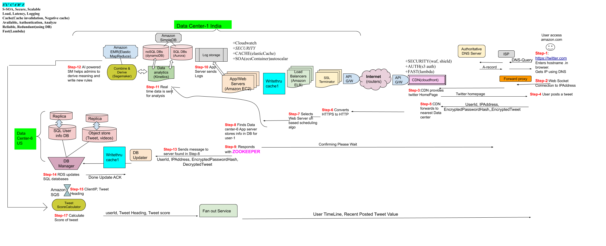

| Mega/Million 10<sup>6</sup> | Giga/Billion 10<sup>9</sup> | Tera/Trillion 10<sup>12</sup> | Peta/Quadrillion 10<sup>15</sup> | Exa/Quintillion 10<sup>18</sup> | Zeta/Sextillion 10<sup>21</sup> |
| --- | --- | --- | --- | --- | --- |

## Distributed Cache / Cooperative Cache
> Eg: [Redis](https://github.com/amitkumar50/Code-examples/blob/master/System-Design/Concepts/Cache/DB_Caches/Redis/README.md), [Memcached](https://github.com/amitkumar50/Code-examples/blob/master/System-Design/Concepts/Cache/DB_Caches/Memcached/README.md)
- **What** Cache is faster than Hard-disk or DB, because its size is small(wrt hard disk) hence search time is less. Cache stores recent queries only.
- **Place where cache can be placed?** Consider twitter Application example.
  - *1.* On Web Proxy serving Web client.
  - *2.* Between Web server & database.
  - *3.* Before web-server, to serve recent contents.
```c 
 App/Webserver --- Cache -- Database
 Loadbalabncer --- Cache -- WebServer
```

## 1. Requirements
- **Functional**
  - *1.* Store recent data
  - *2.* Low latency. (Latency: Delay between last packet sent and 1st packet received)
- **Non-Functional:** Consistent, Should be distributed
- **Extended:** S<sup>3</sup> L<sup>3</sup> C<sup>2</sup> A<sup>3</sup> R<sup>2</sup> F

## 2. BOE
- Assuming Cache is deployed at twiteer. [BOE same as twitter](https://github.com/amitkumar50/Code-examples/blob/master/System-Design/scalable/twitter/README.md)
- **[Traffic Estimates(same as twitter)](https://github.com/amitkumar50/Code-examples/blob/master/System-Design/scalable/twitter/README.md)**
- **[Storage Estimates](https://github.com/amitkumar50/Code-examples/blob/master/System-Design/scalable/twitter/README.md)**
  - 1 Machine can store 10TB to 50TB.
  - Number of machines required to build Distributed cache = (Total storage for 1 day = 300TB)/10TB = 300-400. 
- **Latency** 1ms (GET or POST)
  
# 3. HLD
## 3a. Where Cache Fits?
- Cache will only be used during fannout of tweets, ie updating timelines. While storing tweets to DB cache will only be updated.


## 3b. [Places where cache fits](https://github.com/amitkumar50/Code-examples/tree/master/System-Design/Concepts/Cache/Where_Cache_Can_Be_Placed/README.md)
- **1. Web Browser Cache**
- **2. Web Proxy Cache**
- **3. Distributed Cache between Application server and DB**
  
## 3c. [Distributed Cache:Memcached](https://github.com/amitkumar50/Code-examples/tree/master/System-Design/Concepts/Cache/Where_Cache_Can_Be_Placed/README.md)
### [1. Cache Purging: LRU](https://github.com/amitkumar50/Code-examples/blob/master/DS_Questions/Questions/random/LRUCache/lru_cache_key_and_value.md)
  - LRU uses Doubly Linked List and Hash Table to achieve O(1) for search/insert/remove `<key=priority,value=Address>`
  
### 2. Types of Cache
  - Which method to use for cache depends on use case.

|Method|What|Drawback|Adv|
|---|---|---|---|
|1. Write through Cache|The data is written into cache and DB at same time.|Higher Latency, since every write operation is done twice|Maintains data consistency between DB the cache|
|2. Write Around Cache|Write goes directly to DB. Operation is complete after writing to DB|Reading recent data is cache miss and has high latency since need to be read from DB.|Cache not flooded|
|3. Write Back Cache| Write done to cache only Cache writes the info to DB(asynchronously).|Data availability risk(cache may fail)|Low latency, High throughput|

# 4. Tradeoffs/Bottlenecks
- 
