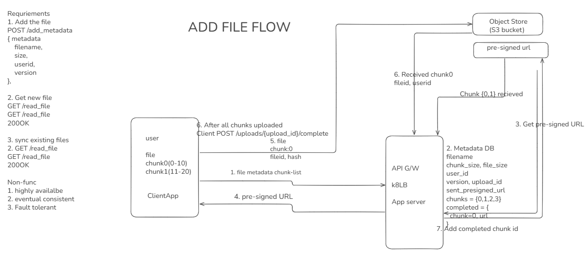
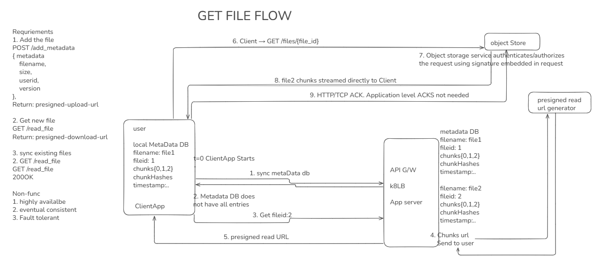
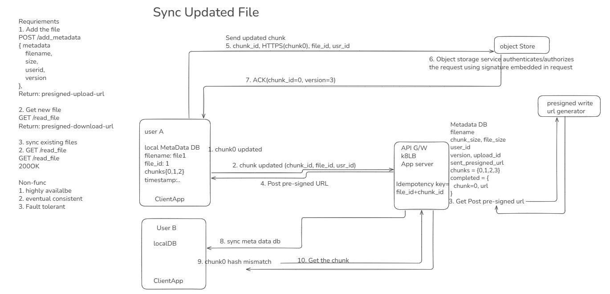

:toc:
:toclevels: 6

= Distributed DropBox/Google Drive/Cloud File Storage?
This is file hosting service. Securely storing data on Distributed remote servers. Read:Write ratio is same.

= 1. Requirements
- **Functional:**
  1. Create(Upload/PUT) new file on google drive, save this on cloud
  2. Read(GET) file when cerate on cloud shared with this user. Sharing/authorization userA(editor), userB(reader only)
  3. Sync(GET) Updated file. User-A changes a file, User-B want to sync the updated file on its Google Driver Desktop
  4. Once login to goggle drive, sync all files in workspace.
  5. Concurrent Edit

 
- **Non-functional:**
  1. Highly available
  2. Eventual consistent: Means replicas may temporarily return different versions but eventually converge. What is SLA to be eventual consistent(5 sec or 30 sec)?
  3. Offline edit. User is offline, he edits the file, Once User comes online information should go on drive.
  4. Deduplication: Same file upload(PUT) 2 times, should only be stored once on DB
  
- **Extended:**
  1. Snaphot of data: System should support snapshotting of the data, so that users can go back to any version of the files.

= 2. BOE
```
|World Population|InternetUsers(60%)|DropBox users(2%)|Daily Active users(10~12%)|
|---|---|---|---|
|7 Billion //Year 2020|7 x 0.6 = 4.2 Billion|4.2 x 0.2 = 840 Million |840 x .12 = 100 Million|
```

- **Storage Estimates:** Assume On average each user has 500 file/photos daily. 
  - Each file=100KB. Storage/day 100M x 100K x 500 = 5PB. For 5 years = 5 x 30 x 12 x 5 = 9ExaBytes

- **Traffic Estimates:** Assume 1M active users/min. Each sending 100KB file. 100GB/min. 166MB/sec

= 3. HLD
```
|--- laptop ------|                    |--------------- Datacenter --------------------------------------------|
|User -> ClientApp| --> GLB(GlobalLB)  |                                                                       |
|--------- | -----|        \/          |                                                                       |
           |           Regional LB  -------> Nginx ---> KubernetsIngressLB ---> AppServer --metadata--> SQLDB  |
           |                           |                                                                       |
           |----------upload FILE CHUNK using presigned URL --------------> Object Store                       | 
                                       |-----------------------------------------------------------------------|
File's Metadata table (Document db json mongodb):   
file_id
owner_id
filename
size
version
object_key
upload_id
status
checksum
created_at

```

== 1. Create(Upload/PUT) new file



=== Non-Functional
==== a. High Availability
- Metadata Database replication
- multipods

==== b. Resumanble Upload
- Client sends chunk0, Object store will send HTTP-ACK back to client.
- Client crashes before sending chunk1
- Once client restarts it checks which chunks have ACK and will not send those again

==== b. Resumable Download
- Server sends chunk0 to client, client sends ACK and client crashes
- Client restarts, checks for chunks from server, but on server file is updated.
- Server will 1st send the prev version which client was having. Once ver1 is sent completely to client, then server will send ver2
```
Server               Client
    --chunk1,2,3--> Version=1 downloaded
    --version=2---> Now new version is downloaded
```

===== Download using HTTP Range Requests
- if client downloads 10G(of 50G file) from server and crashes.
- Client can send range to server to download 11G onwards
```
GET <presigned-upload-URL>
Range: bytes=10G-
```

==== c. Fault Tolerance (failover to other Pod, DB Redundancy)
if some pods crash system still continue working without downtime. server(pod1) writes the meta data to shared DB, if pod1 crashes pod2 will pick from that state and continue work

==== d. Eventual Consistent
- Ask from interviewer. What's agreed SLA for eventual consistency (3 or 30 sec)?
- Replicas may temporarily return different versions but eventually converge
```
file1 → version 4
file2 → version 5
```
- Files will be versioned, once clientApp finds locally metadata DB has version=4 and version=5 from server, it will sync

==== e. Idempotency / Deduplication
- ClientApp sends chunk-0, chunk-1. Server recieved chunk-0, chunk-1 and sends ACK1, ACK2. ClientApp recieves ACK1 & network failure happened, ClientApp did not recieve ACK2.
- Network resumes and clientApp sends chunk-1 again.
- In order for server to not create 2 copies of chunk-1, Server need to maintain a idempotency key which is(file_id + version + chunk_number). if same key is found duplicate is rejected.


== 2. GET. Read file from server



== 3. Sync the updated File
```
v1: chunk-0 → A
    chunk-1 → B 
    chunk-2 → C

v2: chunk-0 → A
    chunk-1 → D <<< Changed
    chunk-2 → C

```
- user changes bytes chunk1(C). ClientApp will send Delta:(file_id, version, chunk_id, start_offset, end_offset, delta_object_pointer) to server




= Flow Diagram
- *1-6.* Same as [Facebook newsfeed]()
- *7.* Application server stores connection info in conn_db. Push file Content, MetaData recieved from client on [MOM]().
- *8.* Updater will receive notification, stores file Content on [Object Store]() and meta data on [SQL DB]().
- *9.* Pooler service keeps on pooling for changed row from Meta-data server and recieves notification, it Reads newly/changed added row. Read userId, fileId and pushes on MOM.
- *10.* Acknowledgement service will recieve notification from MOM, gets connection information from conn-DB and sends ACK to userId for FileID.


= DB
- **Data Partitioning?** We can use Hash based [Sharding](/System-Design/Concepts/Databases/Database_Scaling). Take hash of fileId. Hashes from 1-100 goes to DB-server1, 100-200 goes to DB-server2 and so on.
  - Sharding based on Hash of fileId can fail on overloaded environment, We should use [Consistent hashing](/System-Design/Concepts/Hashing)
- **[Caching](/System-Design/Concepts/Cache)?** Before Meta-data-DB: Memcached

= Load Balancers
- [Where Load Balancer can be placed](/System-Design/Concepts/Load_Balancer)? 
  - *a.* B/W client application & Application server. 
  - *b.* B/W client application & meta data sever

= link:/System-Design/Concepts/Bottlenecks_of_Distributed_Systems/Bottlenecks.md[Overall Tradeoffs/Bottlenecks & correction]
- *1.* if 2 users are viewing same file at a time, how consistent view can be provided?
  - *Solution:* 
    - Introduce a synchronization server will read meta-data server and will provide info to users.
    - Instead of transmitting entire files from clients to the server or vice versa, we can just transmit the difference between two versions of a file
- *2.* If high number of clients are connected system may respond slow.
  - *Solution:*
    - Provide MOM between Application server & clients which will queue client requests.
    - Provide MOM between synchronization server & clients. MOM can queue millions of requests.
- *3.* Sharding based on Hash of fileId can fail on overloaded environment.
  - Solution: Consistent hashing

