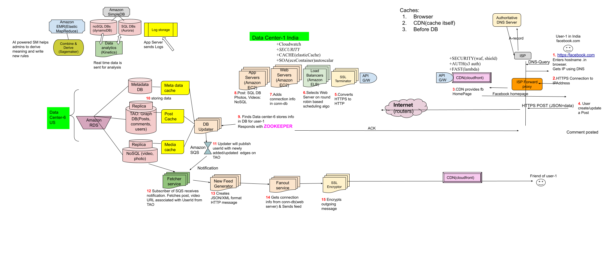

- [What is News Feed](#what)
- [To Cover](/System-Design/Scalable/README.md)
- [1. Requirements](#Requirements)
  - [1.1 Functional](#Functional)
  - [1.2 Non-Functional](#nFunctional)
  - [1.3 Extended](#Extended)
- [2. Back of Envelope Calculations](#boe)
  - [2.1 Traffic Estimates](#te)
  - [2.2 Storage Estimates](#se)
  - **[Extended BOE](./Extended_BOE.md)**
- [3. System APIs](#sa)
- [4. HLD](#hld)
  - [4.1 Steps](#steps)
    - [4.1.1 Post Storage](#postst)
    - [4.1.2 Feed Generation](#feedgen) 
    - [4.1.3 Feed Publishing](#feedpub)
- [5. DB Design](#dbdes)
- [6. Overall Tradeoffs/Bottlenecks & correction](#overall)
  - [6.1 Issues in Feed Generation Service](#issues)
  - [6.2 Solutions](#solutions)
- [7. Adjusting to changing requirements](/System-Design/Concepts/Changing_Requirements)

# [HTML NewFeed Design](https://code-with-amitk.github.io/System_Design/Scalable/Facebook/Facebook%20News%20Feed.html)

<a name=what></a>
## What is FB News Feed
- Whenever someone logs into account. He finds content posted on his network using new feed.
  - friend activities(status updates, photos, videos etc)
  - profile changes, upcoming events
  - news(if subscribed).

<a name=Requirements></a>
## 1. Requirements

<a name=Functional></a>
#### 1.1 Functional
  - *a.* User should see his new feed as he logs in.
  - *b.* Newsfeed should contain posts from the people, pages, groups that a user follows.
  - *c.* Feeds can have text, images, videos.
<a name=nFunctional></a>
#### 1.2 Non-Functional
  - *a.* News feed should be generated on the fly. Max latency should not be more than 2 sec.
  - *b.* News feed should give soothing/smiling effect to user.
  - *b.* Option for extending news feed once news feed gets over.
<a name=Extended></a>
#### 1.3 Extended
  - *a.* Option to hide/disable news feed.
  - *b.* AI powered user specific search items

<a name=boe></a>
## 2. Back Of Envelope Calculations
```console
World Population      | InternetUsers(60%)    | FB Users(80-85% of Internet users) | Active FB Users(20%)
----------------------|-----------------------|------------------------------------|--------------------
7 Billion //Year 2020 | 7 x 0.6 = 4.2 Billion |    4.2 x 0.8 = 3.5 Billion         | 3.5 x .2 = 700 Million
```
<a name=te></a>
#### 2.1 Traffic Estimates
  - 700 Million pulling their new feed 5 times a day. Total New feed requests = 700 x 5 = 3500 Million requests/day.
  - 3500/24x60x60 = Around 39,000 Requests/sec.
<a name=se></a>
#### 2.2 Storage Estimates
- **Cache/CDN** 
  - Suppose We want to keep 500 posts/user on [CDN](/System-Design/Concepts/CDN/README.md) for quick fetch.
  - Total posts to be stored. 500 x 700 Million = 350 Billion.
  - Let's assume on average each posts is 1 KB in size. Total bytes = 350 TB
  - Assuming 1 server can cache is 100GB. Total servers needed = 350 TB / 100 GB = 3500 Machines needed in total

<a name=sa></a>
## 3. System APIs
```c
GetUserNewsFeed(string User_key, string user_id, string since_id, int count, max_id, exclude_replies)
Parameters:
	|- User_Key (string): Fetching user feed quickly
	|- user_id (string)
	|- since_id (string): Optional; returns results with an ID higher than (that is, more recent than) the specified ID.
	|- count (number): Optional; specifies the number of feed items to try and retrieve up to a maximum of 200 per distinct request.
	|- max_id (number): Optional; returns results with an ID less than (that is, older than) or equal to the specified ID.
	|- exclude_replies(boolean): Optional; this parameter will prevent replies from appearing in the returned timeline.

Returns: (JSON) Returns a JSON object containing a list of feed items.
```

<a name=hld></a>
## 4. High Level design
- FB stores users,posts,comments using **[TAO](/System-Design/Concepts/Databases/NOSQL/Graph_DB/Facebook_TAO/README.md)**
- There are 3 parts to design.
  - *A. POST STORAGE:* User creating a post, backend stores the post.
  - *B. FEED GENERATION:* Backend system generating news feed for his friends/followers.
  - *c. FEED PUBLISHING:* Publishing feed to user. 

<a name=steps></a>
### 4.1 Steps
- *1.* Mobile/App enters facebook.com in browser. Browser gets IP address using [DNS](/Networking/OSI-Layers/Layer5/Protocols/DNS/Name_Resolution)
  - Browser can have [Cache](/System-Design/Concepts/Cache/Where_Cache_Can_Be_Placed/README.md) But assuming cache is stale.
- *2.* [HTTPS](/Networking/OSI-Layers/Layer5/Protocols/HTTP/GET_Document.md) Packet is created by Browser `GET www.facebook.com/index.html HTTP/1.1`, sent to [Forward Proxy](/System-Design/Concepts/Proxy_Servers/README.md) server hosted by ISP/Office Server. ISP forward request to next router in internet.
- *3.* [CDN](/System-Design/Concepts/CDN/README.md) will be hosting homepage, periodically updating the page from Web Server. CDN renders the home page.
- *4.* User creates a post, upload a photo, Video. Browser creates a [HTTP POST](/Networking/OSI-Layers/Layer5/Protocols/HTTP/GET_Document.md) message packages post,video in JSON/XML and sends to server.
- *5.* SSL Terminator decrypts packet and sends to Load Balancer. Before sending TCP-3-way handshake must be completed.
- *6.* [Load Balancer](/System-Design/Concepts/Load_Balancer/What_is_LoadBalancer.md) selects Web server based on [Round Robin scheduling algo](/System-Design/Concepts/Load_Balancer/Scheduling_Algo_of_Load_Balancers.md) and sends packet.

<a name=postst></a>
#### 4.1.1 Post Storage
  - *7. [Web Server](/Networking/OSI-Layers/Layer5/ApplicationServer_WebServer/README.md)* maintain connection-DB(struct {sockfd, ip, connection_time, expiry}) for each user and creates entry for user. This connection will be used to transfer data between the user and the server.
  - *8. [Application server](/Networking/OSI-Layers/Layer5/ApplicationServer_WebServer/README.md):* Handle storing new posts in the DB servers.
  - *9. Database updater* DB Frontend which manages updating the DB. Sends acknowledgment using zookeeper.
  - *10. [TAO(Graph DB)](/System-Design/Concepts/Databases/NOSQL/Graph_DB/Facebook_TAO/README.md)* stores Posts, comments, users. *[NOSQL](/System-Design/Concepts/Databases/README.md)* stores photos, videos.

<a name=feedgen></a>
#### 4.1.2 Feed Generation 
- Backend system generating news feed for his friends/followers
  - *11. Database updater* Will also update [Message Queue(MOM)](/System-Design/Concepts/MOM_ESB/README.md) with newly updated UserId's ie any userId who have newly added edges on TAO.
  - *12. Fetcher service(subscriber in MOM)* gets notification and starts fetching edges of userId posts,photo,videos URL's and forwards to News Feed Generator service.
  - *13. New Feed Generator Service* Will create JSON/XML Content for HTTP message.

<a name=feedpub></a>
#### 4.1.3 Feed Publishing 
- Publishing feed to user. 
```c 
  - FB need to retrieve all friends of person who commented/posted.
  - Retrieve latest, most popular and relevant posts for those IDs. Rank these posts based on the relevance to Amit (in maxHeap).
  - Once 1st 20 posts on feed are pushed, push next 20.
```
  - *14. Fanout Service* Will get connection information from web-server and sends HTTP message on that socket.
    - When new connection comes in, session-id is generated and attached to user-id. UserId stored on TAO. Using this session-id, information can be fetched from connection-db.
  - *15. SSL Encryptor* Encrypts the message and using CDN[(write thru cache)](/System-Design/Concepts/Cache/Types_of_Distributed_Caches/README.md) sends New feed to client.


   
<a name=dbdes></a>
## 5. DB Design
- **[5a. DB Schema/TAO](/System-Design/Concepts/Databases/NOSQL/Graph_DB/Facebook_TAO/README.md)**
- **5b. DB Queries**
  - Fetching most recent posts from all the users/entities that User follows:
```
(SELECT FeedItemID(or userID) FROM FeedItem WHERE UserID in (
    SELECT EntityOrFriendID FROM UserFollow WHERE UserID = <current_user_id> and type = 0(user))
)
UNION
(SELECT FeedItemID FROM FeedItem WHERE EntityID in (
    SELECT EntityOrFriendID FROM UserFollow WHERE UserID = <current_user_id> and type = 1(entity))
)
ORDER BY CreationDate DESC 
LIMIT 100
```
- **5c. DB Sharding for storing Feed** similar design as discussed in Twitter.
- **5d. DB scheme for storing Feed before fannout**
  - We will store feed for user before it's fanned out to user.
  - Try storing all the data of a user on one server.
  - For future growth and replication, we must use [Consistent Hashing](/System-Design/Concepts/Hashing/Consistent_Hashing.md)

<a name=overall></a>
## [6. Overall Tradeoffs/Bottlenecks & correction](/System-Design/Concepts/Bottlenecks_of_Distributed_Systems/Bottlenecks.md)

<a name=issues></a>
#### 6.1 Issues in Feed Generation Service
|Issue|Description|
|---|---|
|1.Huge Friend list|Feed Generator service performs slow for users having huge friend list|
|2.User requested timeline generation|Suppose 1M users loads page together, feed needed to be generated, this will make system slow|
|3.Live Updates|Feed updates for all followers. High backlog on feed generation service.|
|4.People having 1M+ followers|if this person provides live feed, pushing feed to all his followers is huge load on system|
|5.Feed Ranking|How can we decide which post need to be on top on news feed and which last?|

<a name=solutions></a>
##### 6.2 Solutions
  - **1. Offline feed generator system & Storage** This system will generate feed and store on memory, serve to user as he comes online. Feed is stored for every user seperately.
    - *Issue: How many items to be stored for particular user?* Initialy:500. Later based on user's usage statistics. if user does not comes online for long period then this might be reduced.
  - **2. Stop Automatic fanout of celebrity users.** Since celebrity users have high number of followers, we might not push automatic updates to followers as becomes available, we can push feed once user asks for(not when user gets online).
  - **3. Feed Items Ranking.** Ranking score can be calculated based on number of likes, comments, shares, time of the update, whether the post has images/videos, etc. 
