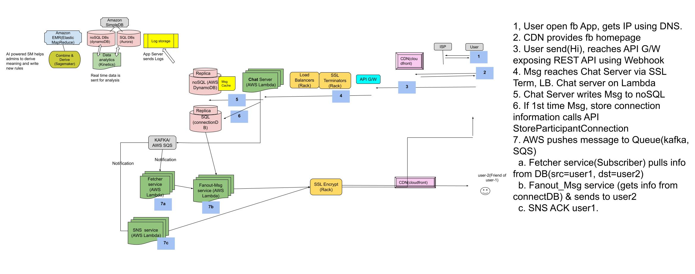

**What?**
- This is instant messaging service where users can send text messages to each other through web and mobile.

## [To Cover](/System-Design/Scalable)

## 1. Requirements
- **Functional**
  - *1.* user can chat 1-to-1 with his friend.
  - *2.* Chat history should be stored.
  - *3.* Online/Offline users should be shown to user.
  - *4.* User can send message to any person on facebook provided target person has not blocked incoming messages.
- **Non-Functional**
  - *1.* Highly [Consistent](/System-Design/Terms). User should see same data across all devices.
  - *2.* min [Latency](/System-Design/Terms)
- **[Extended](/Scalable/README.md)** 
  - Group chats
  - Messenger should be able to notify users of new messages when they are offline.

> {text < 650 characters} {audio < 1 min/10 MB}   {video < 45min/1 GB}

## 2. BOE Calculations

|World Population|Daily Internet Users(30%)|FB Users(30% of Internet users)/day|(Let's assume)Each user sends 50 messages/day|
|---|---|---|---|
|7x109//Year 2020|7B x .3 =~ 2 Billion|2B x .3 = 600 Million/day|600M x 50 = 30 Billion messages sent/day|

- **Storage Estimates:**  //Compression not considered
  - (Let's Assume) On Average Message contains=100 characters. 1 character=4 bits. 100 characters = 400 bits = 400/8 = 50 bytes.
  - 50 x 30 B = 1500 Billion = 1.5 Tera Bytes/Day. 1.5TB x 365 days x 5 years ~= 2.7 Peta Bytes

- **Traffic/Bandwidth Estimates:**  //Since data need to go to users. Upload,download both = 17MB/s
  - Incoming data/day = 1.5TB. Incoming Data/second = 1.5TB/86400 ~= 17MB/s

# 3. HLD

### Steps
  - *1-6* Same as [Facebook newsfeed](/System-Design/Scalable/Facebook/News%20Feed)
  - *7.* User-1 will keep a connection open with the server to receive ACK. [App/Chat-server](/Networking/OSI-Layers/Layer5/ApplicationServer_WebServer) sends ack back to user-1 using zookeeper. Also pushes message on [MOM](/System-Design/Concepts/MOM_ESB)
  - *8.* db-update gets notification and updates DB(with Message and timestamp). Timestamp will maintain ordering of messages. Pushes message on MOM.
  - *9.* Fetcher service will recieve notification and gets message from DB. `src=user1,dst=usr2`
  - *10.* fannout-msg service recieves notification and sends message to user-2.
  - *11.* user-2 sends ack to ack-service. Ack-service places ack on MOM.
  - *12.* fannout-ack service will receives notification and sends ack to user-1.

### Others
  - **Method by which Web client connects Application/Chat Server:** [Web Sockets](/Networking/OSI-Layers/Layer5/WebServer_to_WebClient_Connection_Methods)
  - **Number of Application/Chat servers?** 600 Million users daily sending messages. 1 server can handle 60k connection. 600M/60k = 10k servers
  - **[Load Balancer](/System-Design/Concepts/Load_Balancer)** Can maintain hash of userID to serverId and redirect message to appropriate chat server.
  - **What happens when server crashes:** Master-Slave Replicas should be maintained.

## 4. DB Design
### 4a. Use [NoSQL(HBase)](/System-Design/Concepts/Databases/NOSQL/Wide_Coloumn/HBase/README.md). Not [SQLDB](/System-Design/Concepts/Databases)
  - **Why not SQL?** SQL databases are not good for small frequent updates, Since users will send small frequent messages, Because in RDBMS complete row needs to Read/Written(which is heavy operation).
  - **Why noSQL/HBase?** 
    - noSQL database can store multiple values against 1 key. 
    - HBase does not writes small chunks of data but write all data at once.
      - How many HBase databases required? Assuming 1 HBase-DB can store 10 TB. 2.7PB/10TB = 1000
### 4b. Storing chats on DB
  - [Sharding based on userId](/System-Design/Concepts/Databases/Database_Scaling)

## 5. Extended Req
- **1. Group-Chat**
  - Create a seperate table/Object called GroupChat. Each groupchat will have GroupChatId and will contain userIds which are part of GroupChat.

## [6. Overall Tradeoffs/Bottlenecks & correction](/System-Design/Concepts/Bottlenecks_of_Distributed_Systems)

## [7. Adjusting to changing requirements](/System-Design/Concepts/Changing_Requirements)
