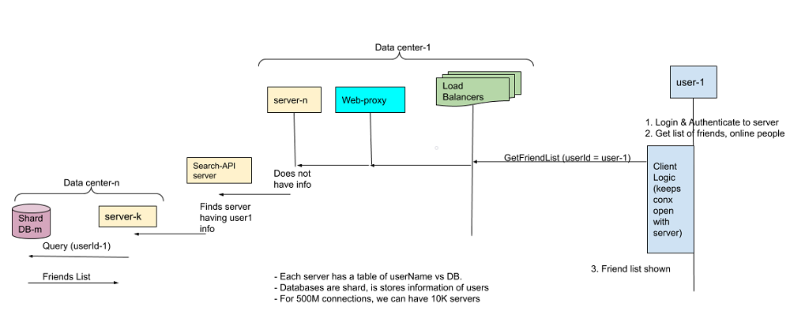
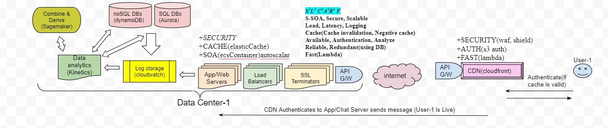

## [To Cover](/System-Design/Scalable)

**What?**
- This is instant messaging service where users can send text messages to each other through web and mobile.

## 1. Requirements
- **Functional**
  - *1.* user can chat 1-to-1 with his friend.
  - *2.* Chat history should be stored.
  - *3.* Online/Offline users should be shown to user.
  - *4.* User can send message to any person on facebook provided target person has not blocked incoming messages.
- **Non-Functional**
  - *1.* Highly [Consistent](/System-Design/Concepts/Bottlenecks_of_Distributed_Systems/Bottlenecks.md). User should see same data across all devices.
  - *2.* min [Latency](/Scalable/README.md)
  - These sizes can be delivered as 1 message.
- **[Extended](/Scalable/README.md)** 
  - Group chats
  - Push notifications: Messenger should be able to notify users of new messages when they are offline.

> {text < 650 characters} {audio < 1 min/10 MB}   {video < 45min/1 GB}

## 2. BOE Calculations

|World Population|Daily Internet Users(30%)|FB Users(30% of Internet users)|(Let's assume)Each user sends 50 messages/day|
|---|---|---|---|
|7x109//Year 2020|7B x .3 =~ 2 Billion|2B x .3 = 600 Million|600M x 50 = 30 Billion messages sent/day|

- **Storage Estimates:**  //Compression not considered
  - (Let's Assume) On Average Message contains=100 characters. 1 character=4 bits. 100 characters = 400 bits = 400/8 = 50 bytes.
  - 50 x 30 B = 1500 Billion = 1.5 Tera Bytes/Day. 1.5TB x 365 days x 5 years ~= 2.7 Peta Bytes

- **Traffic/Bandwidth Estimates:**  //Since data need to go to users. Upload,download both = 17MB/s
  - Incoming data/day = 1.5TB. Incoming Data/second = 1.5TB/86400 ~= 17MB/s

# 3. HLD

### Steps
- *1-6* Same as facebook newsfeed.
- *7.* Chat-server receives the message from user-1.
- *8.* chat server sends ack back to user-1 using zookeepr. Also pushes message on MOM
- *9.* db-update gets notification and updates DB.
- *10.* fannout-msg service recieves notification and sends message to user.
- *11.* user-2 sends ack to ack-service. Ack-service places ack on MOM.
- *12.* fannout-ack service will receives notification and sends ack to user-1.

### Method by which Web client connects Application/Chat Server
  - [Web Sockets](/Networking/OSI-Layers/Layer5/WebServer_to_WebClient_Connection_Methods)

## 3B. 10Lac to 1Cr Users

- **1. Get Friend List of user**

- **2. Get list of Live users**

- **3. User sending "Hi" to friend**

- **4. How many Chat servers are needed**
  - Asumming 1 Billion incoming text messages. 1 server can handle 1 lac connections. 1 Billion/1 lac = 10k chat servers.

- **5. What happens when server crashes?**
  - Server pairs should operate in master-slave mode, when 1 server fails complete connection information(for active clients) should be tranferred to slave.

## 4. DB Requirements
- **1. Which DB is better in this usecase SQL or noSQL**

||RDBMS(mongoDB,MySQL)|NoSQL(HBase)|
|---|---|---|
|Fit for this usecase|<ul><li>No</li></ul><ul><li>SQL databases are not good for small frequent updates, Since users will send small frequent messages</li></ul><ul><li>Because in RDBMS complete row needs to Read/Written(which is heavy operation)</li></ul>|<ul><li>Yes</li></ul><ul><li>Because noSQL database can store multiple values against 1 key</li></ul><ul><li>|
  
- **2. How many HBase databases required?**
  - Assuming 1 HBase-DB can store 10 TB. `157 zeta bytes / 10 TB  = 10pow9`
  - That's high number of Databases, we need to compress or deploy method to increase storage capacity on databases.

- **3. Group-Chat**
  - Database can store a seperate coloumn for group-chat(Identified by GroupChat-ID)
  - This entry will contain all userId's who are part of group chat.
  - Once a message is sent on group, Message is copied to data-stores of respective user Id's.

## 5. S3 L3 C2 A3 R2 F

