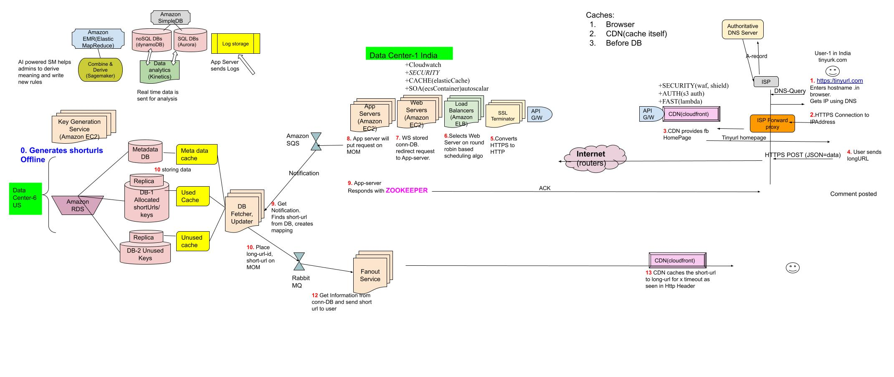

**URL Shorterning**
- [1. Requirements](#req)
- [2. BOE](#boe)
- [3. API Design](#api)
- [4. HLD](#hld)

### FACT(Erez,Navita): Interviewers quickly want to see HLD/Blocks(not BOE).

## Tinyurl
- **What?** This service will provide shortened aliases redirecting to long URLs. Users are redirected to longURL as they hit short URL.
- **Why?** Short links save a lot of space when displayed, printed, messaged, or tweeted. Additionally, users are less likely to mistype shorter URLs.
- **This is Read Heavy Application. Read:Write=100:1:**
  - _Why?_ For 1 long URL, 1 short URL will be generated. Now this short URL will be used multiple places(tweets,docs etc). Everytime short url is hit, long url is read.
    - Read Request = Redirection = 100
    - Write Request = Create shortURL = 1

## [To Cover](/System-Design/Scalable/README.md)

<a name=req></a>
### 1. Requirements
#### a. Functional
  - Generate short url of long.
  - On click of shorturl, redirection should happen to long url.
#### b. Non-Functional
- custom short url picking allowed
- Links should expire after default time span.
- Highly available, Minimum latency
#### c. Extended
- Analytics; e.g., how many times a redirection happened?

<a name=boe></a>
### 2. BOE  //Ask from Interviewer: What is traffic Volume?
- 100 M hits/day. 100M urls generated/day. 100M/86400 = 1000 urls/sec
#### QPS/Traffic Estimates
- Writes = 1000 urls/sec
- Reads = 10000 urls/sec
#### Storage Estimates
- Long url=256 bytes. Short url=6bytes. Total=262 bytes
- Storage(5 years): 10 M x 30 x 12 x 5 x 262 = 4TB
#### Cache Estimates
  - To improve performance lets cache some URLs. Let's assume we will cache data for 1 day.
  - Following 80:20 rule, 20% of URLs are often hit.
    - Total requests/day = 250k x 12 = 30000k = 30M
    - We will Cache only 20%. 30M x .2 = 6M. //there will be many duplicate requests (of the same URL), our actual memory usage will be less than 6M

<a name=api></a>
### 3. API Design //REST
- _1. Short URL:_ Http POST request for generating shorturl of long and storing on server 
```c
POST api/v1/data(longurl)

string shorturl url_shortening(string longurl)
```
- _2. URL Redirection:_ HTTP GET request to longurl from short url.
```c
GET api/v1/data(shorturl)
string longurl url_redirection(string shorturl)

client                        server1
      ----GET shorturl------>
      <----301 redirect longurl-
      ------longurl--------------------------> server2
```
- _3. Delete URL:_ 
```c
DELETE api/v1/shorturl

void deleteURL(api_dev_key, url_key)
  api_key: uuid(unique id of user)
```

<a name=hld></a>
### 4. HLD 
#### 1 user, 1 server
```c
client                                  server
  ---------POST api/v1/longurl--------->
                                     longurl => |Hash_Fun| => shorturl
                                     shorturl
                                      |----> unordered_map (In memory)
                                      |----> file (on disk)
```
#### 10 M Users
**Steps**
- *0.* Generating short-url for Long-url. There are 2 methods:
  - *a.* Runtime: As we get write request, generate short-url. This makes system slow.
  - *b. Offline(We take this):* Fast. KGS will keep generating shorturls offline and keep pushing on DB.  {See below Generating short-url by KGS}
- *1. to 6.* Same as [Facebook newsFeed](/System-Design/Scalable/facebook/News%20Feed/README.md)
- *7.* Web Server stores connection information in conn-db it will redirect request to App-Server.
- *8.* App-Server puts the request on [MOM Queue](/System-Design/Concepts/MOM_ESB).
- *9.* DB Fetcher,Updater will recieve notification and finds short-url from DB. Creates mapping in DB.
- *10.* DB Fetcher,Updater will put long-url-id, short-url on MOM.
- *11.* Fanout service receives notification. Gets connection information from conn-db and sends shorturl to user.
- *12.* CDN caches the short-url to long-url for x timeout as seen in Http Header.



### Generating short-url/keys by Short-URL-Generation/Key-Generation-Service
#### Steps of Generating short-url
- *a.* Calculate [SHA3(512 bit) or MD5(128bit) hash](https://sites.google.com/site/amitinterviewpreparation/networking/layer3/security).
```c
  long-url > |SHA3 or MD5 Hash|  > XXX
```
- *b.* if we return 8 character short URL. Total possible combinations: 64<sup>8</sup> = 2.8 x 10<sup>14</sup> = 280 Trillion. <<Huge Enough
  - Now we need to Convert 128bit hash to [Base-64 format](/System-Design/Concepts/Number_System).
```c
- Base-2 uses 2 bits to create a word : 2=2^1
- Base-8 uses 3 bits to create word : 8=2^3
- Base-16 uses 4 bits to create word: 16=2^4
- Base-64 uses 6 bits to create word: 64=2^6
  - Hash = 128 bits. 128/6 = 21.33 = 21 characters or words. But we need only 8 characters as Output short-url.
```
- *c.* Deducing 8 character short-url from 21 characters.
  - Return 1st 8 characters from 21 characters.
  - Problem: Differnt long URL's can produce same 1st 8 characters.
  - Solution: Append timestamp or userId with longURL and then generate the short url

#### When to Generate Short url? Runtime or offline
- *1.* Runtime. As we get write request, generate short-url and return
- *2.* Offline: Pre-generate short-urls in advance, store in Key-DB for later use.
  - ***KGS(Key Generation Service)***: KGS will generate the 6-letter keys/short-url beforehand and keep in shorturl-DB.
    - Size of Short-url DB? 
      - Base-64 will have 64<sup>6</sup> = 70 Billion unique six letter short-urls.
      - 1 key = 6 characters = 6 bytes. 2<sup>8</sup>=64. Means 8 bits can represent 64 distinct numbers.
      - Total storage = 6 * 70B = 420B 
    - Advantages of before hand key generation:
        - *a.* Run Time calculations saving.
        - *b.* Collions will be saved. We already have generated keys in place hence risk of same key generation is 0
    - How KGS stores short-urls? Using seperate 2 databases.
```c
  DB-1    //stores all allocated keys
  DB-2    //stores unused keys
```

## 5. DB Design
- **Tables in [SQL Database](/System-Design/Concepts/Databases) = 2**
```c
Table-1: Stores URL mappings(long URL to short URL)

  | Long_Url(512 bytes) | Creation_date | Expiration_date | UserID |
  
Table-2 Stores user’s data who created the short link

  | user_name | user_email | creationDate | lastLogin |
```

- **[Replicas](/System-Design/Concepts/Databases/Database_Scaling):** For safe copy of short to long url
- **[DB Paritioning: Range-Based](/System-Design/Concepts/Databases/Database_Scaling):** To store billions of long URL to short URL mapping, we need distributed DB.

- **Cleaning/Purging of DB:** short-url to long-url mapping should be removed after 30 days or when user tells.

## 6. [Cache](/System-Design/Concepts/Cache/Where_Cache_Can_Be_Placed)
- Frequently asked long-url to short-url mappings would be stored in cache between DB-updater service and DB.

## [Bottleneck & Limitations](/System-Design/Concepts/Bottlenecks_of_Distributed_Systems/Bottlenecks.md)
- **Bottlenecks**
  - *1.* A malicious user can try to consume all URL for a day or month.
    - *Solution:* Each user is only allowed to write/read(redirections) configured limit per day.
  - **2. KGS:** KGS can be point of failure
    - *Solution:* Take [Replicas Servers](/System-Design/Concepts/Databases/Database_Scaling) of KGS, replicas can take over to generate and provide keys.
