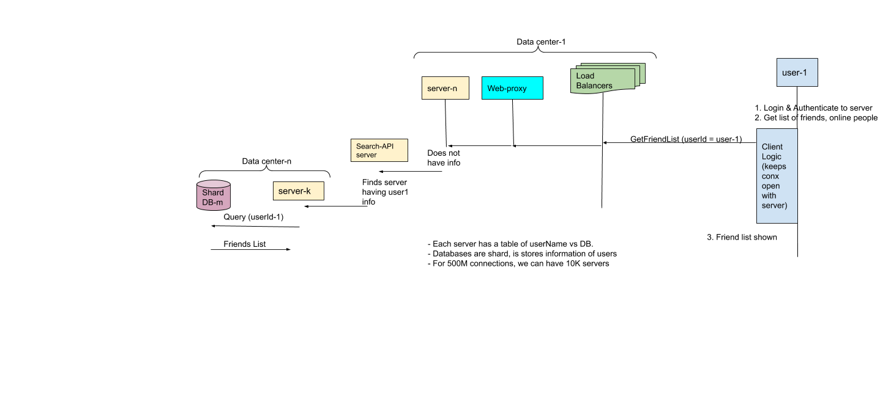

| Mega/Million 10<sup>6</sup> | Giga/Billion 10<sup>9</sup> | Tera/Trillion 10<sup>12</sup> | Peta/Quadrillion 10<sup>15</sup> | Exa/Quintillion 10<sup>18</sup> | Zeta/Sextillion 10<sup>21</sup> |
| --- | --- | --- | --- | --- | --- |

- Users can send text/video/audio/image messages using laptop or mobile.

## To Cover
- Requirements: Functional, Non-functional, Extended(Group chat)
- Back of Envelope Calculations
- HLD: For 2, 100, 1 lac users
- Database schema
- S<sup>3</sup> L<sup>3</sup> C<sup>2</sup> A<sup>3</sup> R<sup>2</sup> F
  - Scalable, Secure, SOA
  - Logging, Load, Latency
  - Cache(Invalidation, negative cache)
  - Available, Accurate, Analyze, Authenticate
  - Reliable, Redundant(Using DB)
  - Fast

## 1. Requirements
### Functional
- (1st) User can see all of his friends and can send message to any of his friend.
- (2nd) Chat history should be stored.  
- (3rd) User can send message to any person on facebook provided target person has not blocked incoming messages.
- These sizes can be delivered as 1 message.
  - {text < 650 characters} {audio < 1 min/10 MB}   {video < 45min/1 GB}

## 2. BOE Calculations

|World Population=7x10<sup>9</sup> //Year 2020|InternetUsers = 40% = 2.8 Billion|FB Users= 60% of Internet users = 1.68 Billion|
|---|---|---|

- **No of users sending**

|Text message/day|Audio Messages/day|Video Messages/day|
|---|---|---|
|60% = 1.68x0.6 = 1 Billion|20% = 1.68x0.2 = 336 Million|5% = 1.68x0.05 = 84 Million|
  
- **Data estimations(bytes to stored)**

| | 1 Day storage Req(bytes) | 5 years storage Req(bytes)
| --- | --- | --- |
| Chat | 1 Billion(messages) x 650x8(size) = 5.2 Tera bytes | 5.2 x 30 x 12 x 5 = 9.3 peta Bytes |
| Audio | 330Million(audio messages) x 10MB(size) = 3.3 Exa bytes | 3.3x30x12x5 = 6 Zeta bytes |
| Video | 84Million(video messages) x 1GB(size) = 84 Exa bytes | 84x30x12x5 = 151 zeta bytes |

Total space requirement for 5 years = 157 zeta bytes
> Not considering users who deleted chat/video/audio/account permanently. Compression, new users added.

- **Bandwidth Capacity Estimations**

| |1 second incoming data = 1 day/24x60x60|
|---|---|
|chat|60x10<sup>6</sup>|
|Audio|70x10<sup>9</sup>|
|Video|972x10<sup>9</sup>|
|Total|10<sup>9</sup> = 1 Giga bytes|
> We will need a link recieve/send(upload/download) 1GB/second.

# 3. HLD
## 3A. 2 users
- **User-1 sending "Hi" to User-2**
```c
User-1                    Registrar
Browser+FbClient            |
  |----  Register --------->|
  |<---200 ok---------------|
  |                              Auth-Server+DB(Kerberos)
  |-Login(Id/hash of password)-------->|
  |                             check hash ok
  |<-------------TGT-------------------|                             
{Req-1}Open UI to see live users                   Ticket-Granting-Server
  |---(Message=Check Live users)+TGT---------------------->|
  |<-----Service Ticket(for Live user service)-------------|            Live-User-Checker(service-1)
  |                                                                     Keeps list of live users/zone
  |                                                                     using keepalive messages sent on
  |                                                                     web sockets
  |------------------------------------Service Ticket+Message=Check Live Users---->|
  |                                                                      Check Live friends of User-1--------> DB or file-1(encrypted,compressed)
  |<------------------Live friends(User ids)+Service Ticket 2----------------------|<---------------------------------|
  |                                                                                                         File-1 contains friend list
{Req-2}Chat with Live User  
  |                                                                    Chat-Server
  |-(Self userID, Friend UserId + message + scanReport + Service Ticket-2)-->|                              Queue
  |                                                                          |--userid-1, userid-2, Message-->|
  |                                                                                                           |
  |                                                                               Connector <---------------->|
  |                                                                           Read from queue
  |                                                        Spawn new non-blocking thread to handle 1k connections
  |                                                                             Thread-n    
  |                                                                                  |--send/recv message------>User-2
  |                - chat History  {Req-2} //(file-2) is maintained/userId containing all chats userId done with friends/world.
  
For 2 user approach
  - A global file-3 containing all userId present on system.
  - Each user chats can be stored in chornological order with timestamps in seperate file. 
```
- **Communication**
  - **1. Online User to server**
    - Client and server will communicate over web sockets, ie client will hold open connection with server.
    - Server will maintain a hash table <key=userId, value=Connection-Structure>. When message comes for userId, server will search in O(1) and send message to userId.
  - **2. Offline User**
    - The server will store the message for a while and retry sending it once the receiver reconnects.

## 3B. 10Lac to 1Cr Users

- **1. Get Friend List of user**



- **2. Get list of Live users**

- **3. User sending "Hi" to friend**


- **4. How many Chat servers are needed**
  - Asumming 1 Billion incoming text messages. 1 server can handle 1 lac connections. 1 Billion/1 lac = 10k chat servers.

- **5. What happens when server crashes?**
  - Server pairs should operate in master-slave mode, when 1 server fails complete connection information(for active clients) should be tranferred to slave.

## 4. DB Requirements
- **1. Which DB is better in this usecase SQL or noSQL**

||RDBMS(mongoDB,MySQL)|NoSQL(HBase)|
|---|---|---|
|Fit for this usecase|<ul><li>No</li></ul><ul><li>SQL databases are not good for small frequent updates, Since users will send small frequent messages</li></ul><ul><li>Because in RDBMS complete row needs to Read/Written(which is heavy operation)</li></ul>|<ul><li>Yes</li></ul><ul><li>Because noSQL database can store multiple values against 1 key</li></ul><ul><li>|
  
- **2. How many HBase databases required?**
  - Assuming 1 HBase-DB can store 10 TB. `157 zeta bytes / 10 TB  = 10pow9`
  - That's high number of Databases, we need to compress or deploy method to increase storage capacity on databases.

- **3. Group-Chat**
  - Database can store a seperate coloumn for group-chat(Identified by GroupChat-ID)
  - This entry will contain all userId's who are part of group chat.
  - Once a message is sent on group, Message is copied to data-stores of respective user Id's.

