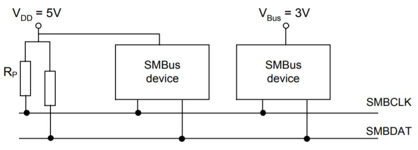

## [SMBus(System Management Bus) http://smbus.org/specs/](http://smbus.org/specs/)
- VDD may be 3 to 5 volts +/- 10% and there may be SMBus devices powered directly by the bus VDD
- SMBCLK and SMBDAT lines are bi-directional. When the bus is free, both lines are high
- **Placing 0 or 1 on Bus**
  - *Placing 0* A device that wants to place a ‘zero’ on the bus must drive the bus line to the defined logic low voltage level. 
  - *Placing 1* Device should release the bus line letting it be pulled high by the bus pull-up circuitry(pull-up resistor or current source).

