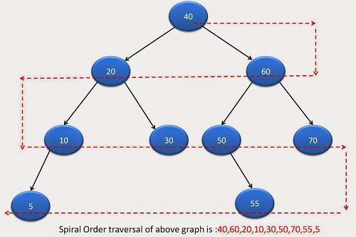

## Problem
- Traverse binary tree in zigzag fashion.
- **Example**
  - Print: 40 60 20 10 30 50 70 55 5
  - Traversal on Levels:
    - Even: Traverse from Left to Right
    - Odd:  Traverse from Right to Left
    


### Logic
- Take 2 stacks. `mainStack<TreeNode*>, tempStack<TreeNode*>`.
  - *1.* mainStack for traversing a particular level
  - *2.* tempStack for storing children at time of traversal
- When mainStack is empty (ie all nodes on particular level) are traversed.
  - Swap mainStack and tempStack
- For Example
```c

```

### Code
```c++
#include<iostream>
#include<stack>
#include<algorithm>
using namespace std;

struct TreeNode {
  int val;
  TreeNode *left;
  TreeNode *right;
  TreeNode() : val(0), left(nullptr), right(nullptr) {}
  TreeNode(int x):val(x), left(nullptr), right(nullptr) {}
  TreeNode(int x, TreeNode *left, TreeNode *right) : val(x), left(left), right(right) {}
};

class Solution {
public:
  void ZigZagTraversal (TreeNode* root) ;
  void PrintZigZag();
  bool isEvenOddTree(TreeNode* root);
private:
  stack<TreeNode*> mainStack;
  stack<TreeNode*> tempStack;
  int level = 0;
};

void Solution::PrintZigZag() {
    while (mainStack.empty() != 1) {
      while (mainStack.empty() != 1) {

        TreeNode* top = mainStack.top();
        mainStack.pop();

        if (!top)
          continue;

        cout<<top->val<<" ";

        if (level%2 == 0) {     //Even level
          tempStack.push(top->left);
          tempStack.push(top->right);
        }
        else                    //Odd level
        {
          tempStack.push(top->right);
          tempStack.push(top->left);
        }
      }

      if (tempStack.empty() != 1)
        tempStack.swap(mainStack);

      ++level;
    }
}

void Solution::ZigZagTraversal (TreeNode *root) {
  if (!root)
    return;

  mainStack.push(root);
  PrintZigZag();
  cout<<"\n";
}

int main(){
  TreeNode a5(5);
  TreeNode a55(55);
  TreeNode a30(30);
  TreeNode a70(70);
  TreeNode a10(10,&a5,nullptr);
  TreeNode a50(50,nullptr,&a55);
  TreeNode a20(20,&a10,&a30);
  TreeNode a60(60,&a50,&a70);
  TreeNode r(40,&a20,&a60);
  
  TreeNode* root = &r;

  Solution s;
  s.ZigZagTraversal(root);
}
```
